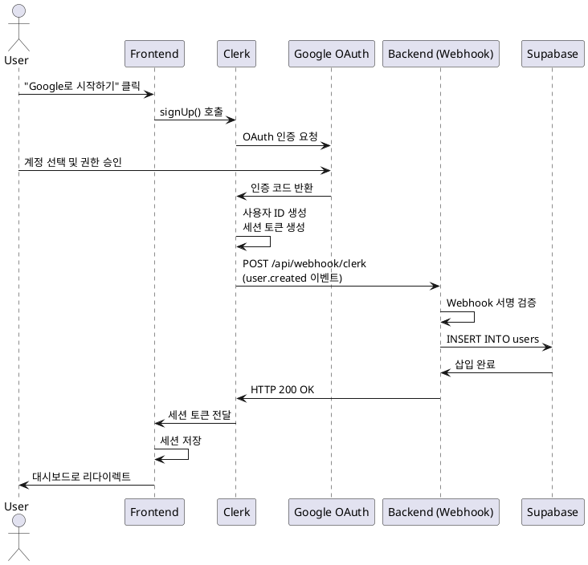

# 유스케이스 UC-001: Google 회원가입

## 1. 개요

### 1.1 목적
Google OAuth를 통해 사용자가 간편하게 서비스에 가입하고, 무료 분석 3회 혜택을 받을 수 있도록 한다.

### 1.2 범위
- Google 계정을 통한 OAuth 인증
- Clerk를 통한 사용자 세션 생성
- Supabase에 사용자 정보 저장
- 무료 분석 횟수 초기화

제외 사항:
- 이메일/비밀번호 기반 회원가입
- 다른 소셜 로그인 (Kakao, Naver 등)

### 1.3 액터
- **주요 액터**: 신규 사용자
- **부 액터**: Clerk (인증 서비스), Google OAuth, Supabase (데이터베이스)

## 2. 선행 조건
- 사용자가 유효한 Google 계정을 보유
- 웹 브라우저가 쿠키 및 JavaScript를 지원
- Clerk Webhook이 배포된 환경에서 정상 작동 (public URL 필요)

## 3. 참여 컴포넌트
- **Frontend**: 회원가입 UI, Clerk SDK 클라이언트 컴포넌트
- **Clerk**: Google OAuth 인증 처리, 사용자 세션 관리
- **Backend**: `/api/webhook/clerk` - user.created Webhook 핸들러
- **Supabase**: users 테이블 - 사용자 정보 저장

## 4. 기본 플로우 (Basic Flow)

### 4.1 단계별 흐름

**[사용자]**: 홈페이지 또는 회원가입 페이지에서 "Google로 시작하기" 버튼 클릭

**[Frontend]**: Clerk SDK의 `<SignUp />` 컴포넌트가 Google OAuth 인증 시작
- **처리**: `signUp` 메서드 호출
- **출력**: Google OAuth 동의 화면으로 리다이렉트

**[사용자]**: Google 계정 선택 및 권한 승인

**[Google OAuth]**: 사용자 인증 후 인증 코드 발급
- **출력**: 인증 코드를 Clerk로 전달

**[Clerk]**: 인증 토큰 생성 및 사용자 정보 수신
- **처리**:
  - 인증 코드 검증
  - 사용자 ID 생성 (`clerk_user_id`)
  - 세션 토큰 생성
  - `user.created` Webhook 이벤트 발생
- **출력**: Frontend에 세션 토큰 전달

**[Backend - Webhook]**: `/api/webhook/clerk` 엔드포인트가 `user.created` 이벤트 수신
- **입력**:
  ```json
  {
    "type": "user.created",
    "data": {
      "id": "clerk_user_abc123",
      "email_addresses": [{ "email_address": "user@example.com" }],
      "first_name": "John"
    }
  }
  ```
- **처리**:
  1. `svix` 라이브러리로 Webhook 서명 검증
  2. 이벤트 타입 확인
  3. 사용자 정보 추출
- **출력**: 검증 성공

**[Supabase]**: users 테이블에 새 레코드 INSERT
- **입력**:
  ```sql
  INSERT INTO users (
    clerk_user_id, email, first_name,
    subscription_tier, analyses_remaining
  ) VALUES (
    'clerk_user_abc123', 'user@example.com', 'John',
    'free', 3
  );
  ```
- **출력**: 사용자 레코드 생성 완료

**[Backend - Webhook]**: HTTP 200 OK 응답 반환

**[Frontend]**: 세션 토큰 저장 및 대시보드로 자동 리다이렉트
- **출력**: 사용자가 대시보드 화면 진입

### 4.2 시퀀스 다이어그램



## 5. 대안 플로우 (Alternative Flows)

### 5.1 이미 가입된 Google 계정으로 가입 시도
**시작 조건**: Clerk가 중복된 이메일 감지

**단계**:
1. Clerk가 기존 계정 존재 확인
2. "이미 가입된 계정입니다. 로그인하시겠습니까?" 메시지 표시
3. 사용자가 "로그인" 선택 시 로그인 플로우로 자동 전환
4. 로그인 완료 후 대시보드로 이동

**결과**: 기존 계정으로 로그인

## 6. 예외 플로우 (Exception Flows)

### 6.1 Google 인증 실패
**발생 조건**: 사용자가 Google 권한 승인 거부 또는 네트워크 오류

**처리 방법**:
1. Clerk가 인증 실패 감지
2. Frontend에 에러 이벤트 전달
3. 에러 메시지 표시: "Google 로그인에 실패했습니다. 다시 시도해주세요."
4. "재시도" 버튼 표시

**에러 코드**: `AUTH_GOOGLE_FAILED` (클라이언트 레벨)

### 6.2 Webhook 서명 검증 실패
**발생 조건**: 잘못된 Webhook 요청 또는 서명 불일치

**처리 방법**:
1. Backend에서 서명 검증 실패 감지
2. HTTP 401 Unauthorized 반환
3. Clerk가 Webhook 재시도 (최대 3회)
4. 로그 기록 및 관리자 알림

**에러 코드**: `WEBHOOK_INVALID_SIGNATURE` (HTTP 401)

### 6.3 Supabase 삽입 실패
**발생 조건**: 데이터베이스 연결 오류 또는 제약 조건 위반

**처리 방법**:
1. Backend에서 INSERT 실패 감지
2. HTTP 500 Internal Server Error 반환
3. Clerk가 Webhook 재시도
4. 사용자는 로그인되지만 대시보드에서 "초기화 중" 메시지 표시
5. 백그라운드에서 사용자 정보 폴링 (5초 간격, 최대 3회)

**에러 코드**: `DB_INSERT_FAILED` (HTTP 500)

**사용자 메시지**: "계정 설정 중입니다. 잠시만 기다려주세요."

### 6.4 Webhook 지연
**발생 조건**: Webhook 응답이 5초 이상 지연

**처리 방법**:
1. Frontend에서 타임아웃 감지
2. 대시보드로 이동하되 "초기화 중" 상태 표시
3. 백그라운드에서 Supabase 사용자 정보 폴링
4. 정보 확인 후 정상 화면 렌더링

**사용자 메시지**: "계정을 설정하고 있습니다..."

## 7. 후행 조건 (Post-conditions)

### 7.1 성공 시
**데이터베이스 변경**:
- `users` 테이블에 새 레코드 생성
  - `clerk_user_id`: Clerk 사용자 ID
  - `email`: Google 이메일
  - `first_name`: 사용자 이름
  - `subscription_tier`: 'free'
  - `analyses_remaining`: 3
  - `created_at`: 가입 시각

**시스템 상태**:
- 사용자 세션 활성화
- 쿠키에 세션 토큰 저장

**외부 시스템**:
- Clerk: 사용자 계정 생성 완료
- Google: OAuth 연동 완료

### 7.2 실패 시
**데이터 롤백**:
- Supabase 삽입 실패 시 Webhook 재시도로 복구
- 복구 불가 시 수동 데이터 정리 필요

**시스템 상태**:
- 사용자 세션 미생성
- 로그인 페이지 유지

## 8. 비기능 요구사항

### 8.1 성능
- Google OAuth 인증: 3초 이내
- Webhook 처리: 1초 이내
- 전체 가입 프로세스: 5초 이내

### 8.2 보안
- Webhook 서명 검증 필수
- `CLERK_WEBHOOK_SECRET` 환경 변수로 보안 관리
- HTTPS 통신 필수
- 세션 토큰은 HttpOnly, Secure 쿠키로 저장

### 8.3 가용성
- Webhook 재시도: 최대 3회
- 타임아웃: 5초
- 백그라운드 폴링으로 사용자 경험 개선

## 9. UI/UX 요구사항

### 9.1 화면 구성
- 회원가입 페이지:
  - "Google로 시작하기" 버튼 (Google 로고 포함)
  - 이용 약관 및 개인정보 처리 방침 링크
  - "이미 계정이 있으신가요? 로그인" 링크

- 로딩 화면:
  - "Google 계정으로 연결 중..." 메시지
  - 스피너 애니메이션

### 9.2 사용자 경험
- 버튼 클릭 즉시 OAuth 창 팝업
- 인증 완료 후 부드러운 리다이렉트
- 에러 발생 시 명확한 메시지 및 재시도 옵션

## 10. 테스트 시나리오

### 10.1 성공 케이스
| 테스트 케이스 ID | 입력값 | 기대 결과 |
|---|---|---|
| TC-001-01 | 유효한 Google 계정 | 회원가입 성공, 대시보드 이동 |
| TC-001-02 | 첫 가입 사용자 | `analyses_remaining = 3` 설정 |

### 10.2 실패 케이스
| 테스트 케이스 ID | 입력값 | 기대 결과 |
|---|---|---|
| TC-001-03 | Google 권한 승인 거부 | 에러 메시지 표시 |
| TC-001-04 | 이미 가입된 계정 | 로그인 플로우로 전환 |
| TC-001-05 | Webhook 실패 | 재시도 또는 폴링으로 복구 |

## 11. 관련 유스케이스
- **후행 유스케이스**: UC-002 (대시보드 진입)
- **연관 유스케이스**: UC-001B (Google 로그인)

## 12. 변경 이력
| 버전 | 날짜 | 작성자 | 변경 내용 |
|---|---|---|---|
| 1.0 | 2025-10-25 | Usecase Writer Agent | 초기 작성 |

## 부록

### A. 용어 정의
- **Clerk**: Next.js용 인증 서비스
- **OAuth**: 외부 서비스 (Google) 계정으로 인증하는 프로토콜
- **Webhook**: 이벤트 발생 시 서버로 자동 전송되는 HTTP POST 요청
- **svix**: Webhook 서명 검증 라이브러리

### B. 참고 자료
- Clerk 문서: https://clerk.com/docs
- Google OAuth 가이드: https://developers.google.com/identity/protocols/oauth2
- Webhook 서명 검증: https://docs.svix.com/receiving/verifying-payloads/how
