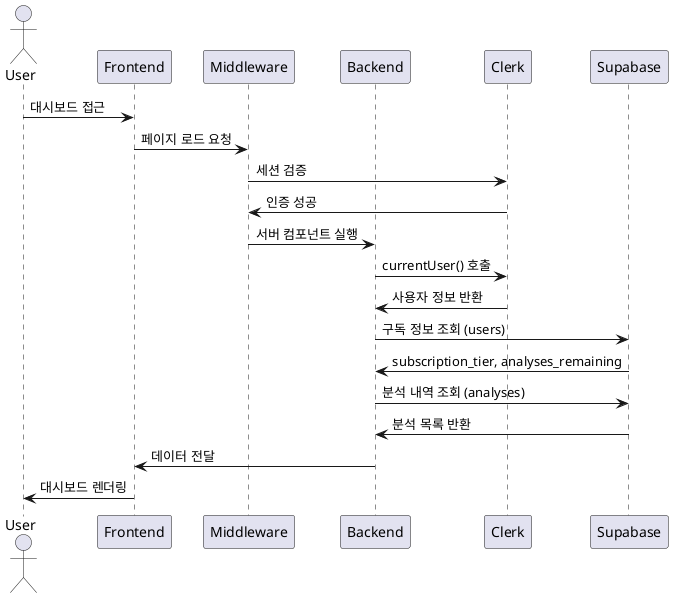

# 유스케이스 UC-002: 대시보드 (분석 목록 조회)

## 1. 개요

### 1.1 목적
사용자가 자신의 구독 상태와 과거 사주 분석 내역을 한눈에 확인할 수 있도록 한다.

### 1.2 범위
- 구독 상태 표시 (무료/Pro, 남은 횟수)
- 분석 내역 목록 조회 (최신순)
- 분석 검색 기능 (이름으로)
- 페이지네이션

제외 사항:
- 분석 결과 상세 내용 (UC-004에서 처리)
- 분석 삭제 기능

### 1.3 액터
- **주요 액터**: 인증된 사용자
- **부 액터**: Clerk, Supabase

## 2. 선행 조건
- 사용자가 Google 계정으로 로그인된 상태
- 유효한 세션 토큰 보유

## 3. 참여 컴포넌트
- **Frontend**: 대시보드 페이지, 검색 UI
- **Middleware**: 인증 상태 확인 (`authMiddleware`)
- **Backend**: Server Component로 데이터 조회
- **Supabase**: users, analyses 테이블

## 4. 기본 플로우 (Basic Flow)

### 4.1 단계별 흐름

**[사용자]**: 대시보드 URL 접근 또는 로그인 후 자동 리다이렉트

**[Middleware]**: 인증 상태 확인
- **처리**: Clerk 세션 토큰 검증
- **출력**: 인증 성공

**[Backend]**: Clerk에서 현재 사용자 정보 조회
- **처리**: `currentUser()` 호출
- **출력**: `clerk_user_id`, `email`, `first_name`

**[Supabase]**: 사용자 구독 정보 조회
- **입력**: `clerk_user_id`
- **처리**:
  ```sql
  SELECT subscription_tier, subscription_ends_at,
         cancelled_at, analyses_remaining
  FROM users
  WHERE clerk_user_id = 'clerk_abc123';
  ```
- **출력**:
  ```json
  {
    "subscription_tier": "free",
    "analyses_remaining": 2
  }
  ```

**[Supabase]**: 사용자의 분석 내역 조회 (최신 10개)
- **처리**:
  ```sql
  SELECT id, name, birth_date, gender, created_at
  FROM analyses
  WHERE user_id = 'user-uuid'
  ORDER BY created_at DESC
  LIMIT 10 OFFSET 0;
  ```
- **출력**: 분석 목록 배열

**[Frontend]**: 대시보드 렌더링
- **분석 내역 없음**:
  - "아직 검사 이력이 없습니다. 첫 검사를 시작해보세요!" 메시지
  - "새 검사하기" 버튼
  - 구독 상태 카드 (남은 무료 분석: 2/3회)

- **분석 내역 있음**:
  - 구독 상태 카드 표시
  - 분석 목록 카드 렌더링 (이름, 날짜, 성별)
  - 검색 입력 필드
  - "새 검사하기" 버튼

### 4.2 시퀀스 다이어그램



## 5. 대안 플로우 (Alternative Flows)

### 5.1 분석 검색
**시작 조건**: 사용자가 검색 입력 필드에 검색어 입력

**단계**:
1. 사용자가 검색어 입력 (예: "홍길")
2. Frontend에서 300ms 디바운스 처리
3. Backend API 호출: `/api/analyses/search?q=홍길`
4. Supabase에서 ILIKE 검색:
   ```sql
   WHERE user_id = 'user-uuid' AND name ILIKE '%홍길%'
   ```
5. 필터링된 결과 반환
6. 검색 결과 렌더링

**결과**: 검색어에 맞는 분석 목록 표시

### 5.2 페이지네이션
**시작 조건**: 분석 내역이 10개 초과

**단계**:
1. 페이지 번호 클릭 또는 스크롤 (Infinite Scroll)
2. Backend에서 OFFSET 계산: `OFFSET = (page - 1) * 10`
3. Supabase 쿼리: `LIMIT 10 OFFSET 10`
4. 추가 데이터 로드 및 렌더링

**결과**: 다음 페이지 분석 목록 표시

## 6. 예외 플로우 (Exception Flows)

### 6.1 인증되지 않은 사용자
**발생 조건**: 세션 토큰 없음 또는 만료

**처리 방법**:
1. Middleware에서 인증 실패 감지
2. 로그인 페이지로 자동 리다이렉트
3. 리다이렉트 후 원래 URL 쿼리 파라미터로 저장: `?redirect=/dashboard`

**에러 코드**: HTTP 302 (Redirect)

### 6.2 Supabase 연결 실패
**발생 조건**: 데이터베이스 연결 오류

**처리 방법**:
1. Backend에서 쿼리 실패 감지
2. 3회 재시도 (500ms 간격)
3. 재시도 실패 시 에러 페이지 렌더링

**사용자 메시지**: "데이터를 불러올 수 없습니다. 잠시 후 다시 시도해주세요."

### 6.3 검색 결과 없음
**발생 조건**: 검색어에 맞는 분석 내역 없음

**처리 방법**:
1. 빈 배열 반환
2. "검색 결과가 없습니다" 메시지 표시
3. 검색어 초기화 버튼 표시

**사용자 메시지**: "'{검색어}'에 대한 검색 결과가 없습니다."

## 7. 후행 조건 (Post-conditions)

### 7.1 성공 시
**시스템 상태**:
- 사용자의 최신 구독 정보 표시
- 분석 목록 캐싱 (선택사항)

### 7.2 실패 시
**시스템 상태**:
- 에러 페이지 또는 로그인 페이지로 이동
- 로그 기록

## 8. 비기능 요구사항

### 8.1 성능
- 페이지 로드: 2초 이내
- 검색: 500ms 이내
- 페이지네이션: 300ms 이내

### 8.2 보안
- RLS 정책으로 다른 사용자 데이터 접근 차단
- SQL Injection 방지 (Supabase Client 사용)

## 9. UI/UX 요구사항

### 9.1 화면 구성
- 구독 상태 카드 (상단):
  - Free: "무료 요금제 | 남은 분석: 2/3회"
  - Pro: "Pro 요금제 | 남은 분석: 7/10회 | 만료일: 2025-11-25"
- 분석 목록 카드:
  - 이름, 성별, 생년월일
  - 분석 날짜 (상대 시간: "3일 전")
  - 클릭 시 상세보기로 이동
- 검색 바 (상단)
- "새 검사하기" 버튼 (우측 하단 고정)

### 9.2 사용자 경험
- 로딩 시 스켈레톤 UI 표시
- 검색 디바운스로 API 호출 최소화
- 분석 카드 호버 시 그림자 효과

## 10. 테스트 시나리오

### 10.1 성공 케이스
| 테스트 케이스 ID | 입력값 | 기대 결과 |
|---|---|---|
| TC-002-01 | 인증된 사용자, 분석 내역 없음 | 안내 메시지 표시 |
| TC-002-02 | 인증된 사용자, 분석 5개 | 5개 카드 표시 |
| TC-002-03 | 검색어 "홍길" | 일치하는 분석만 표시 |

### 10.2 실패 케이스
| 테스트 케이스 ID | 입력값 | 기대 결과 |
|---|---|---|
| TC-002-04 | 인증되지 않은 사용자 | 로그인 페이지로 리다이렉트 |
| TC-002-05 | Supabase 연결 실패 | 에러 메시지 표시 |

## 11. 관련 유스케이스
- **선행 유스케이스**: UC-001 (Google 회원가입/로그인)
- **후행 유스케이스**: UC-003 (새 분석하기), UC-004 (분석 상세보기)

## 12. 변경 이력
| 버전 | 날짜 | 작성자 | 변경 내용 |
|---|---|---|---|
| 1.0 | 2025-10-25 | Usecase Writer Agent | 초기 작성 |
