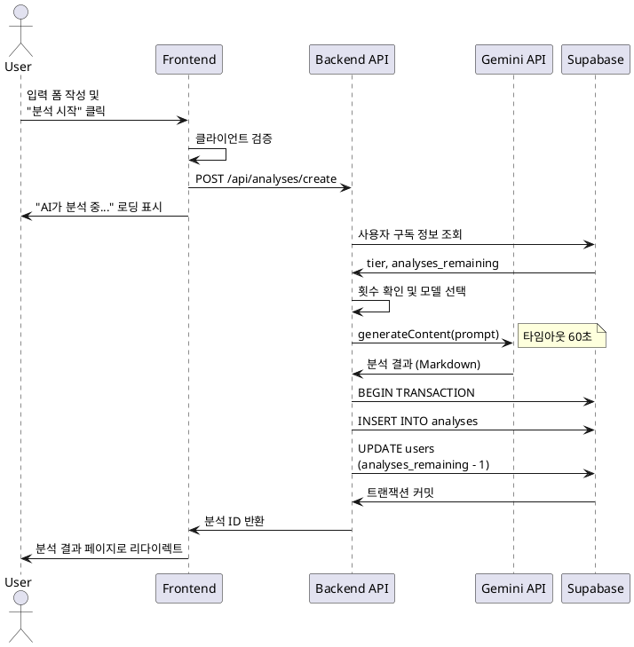

# 유스케이스 UC-003: 새 사주 분석하기

## 1. 개요

### 1.1 목적
사용자가 이름, 생년월일, 성별 등의 정보를 입력하여 Gemini AI 기반 사주 분석을 요청하고 결과를 받는다.

### 1.2 범위
- 분석 대상 정보 입력 및 검증
- 사용자 분석 횟수 확인 및 차감
- Gemini API를 통한 사주 분석 수행
- 분석 결과 저장 및 표시

제외 사항:
- 분석 결과 수정/삭제
- 분석 결과 공유 기능

### 1.3 액터
- **주요 액터**: 인증된 사용자 (Free 또는 Pro)
- **부 액터**: Gemini API, Supabase

## 2. 선행 조건
- 사용자가 로그인된 상태
- 사용자가 분석 횟수 잔여 (`analyses_remaining > 0`)
- Pro 사용자의 경우 구독이 유효 (`subscription_ends_at > NOW()`)

## 3. 참여 컴포넌트
- **Frontend**: 분석 입력 폼, 로딩 UI, 결과 페이지
- **Backend API**: `/api/analyses/create` - 분석 요청 처리
- **Gemini API**: 사주 분석 AI 모델 (flash 또는 pro)
- **Supabase**: users 테이블 (횟수 차감), analyses 테이블 (결과 저장)

## 4. 기본 플로우 (Basic Flow)

### 4.1 단계별 흐름

**[사용자]**: "새 검사하기" 버튼 클릭하여 분석 입력 페이지 진입

**[Frontend]**: 분석 입력 폼 렌더링
- **출력**:
  - 이름 (텍스트 입력)
  - 생년월일 (날짜 선택기)
  - 음력/양력 선택 (라디오 버튼)
  - 출생시간 (시간 선택기 또는 "모름" 체크박스)
  - 성별 (남성/여성 라디오 버튼)
  - 시간대 (드롭다운 또는 텍스트 입력, 선택, 예: Asia/Seoul)
  - 추가 요청사항 (텍스트 영역, 선택)

**[사용자]**: 입력 폼 작성 및 "분석 시작" 버튼 클릭
- **입력 예시**:
  ```json
  {
    "name": "홍길동",
    "birthDate": "1990-01-01",
    "isLunar": false,
    "birthTime": "10:30",
    "gender": "male",
    "timeZone": "Asia/Seoul",
    "additionalInfo": "재물운이 궁금합니다"
  }
  ```

**[Frontend]**: 클라이언트 측 입력 검증
- **처리**:
  - 필수 필드 확인 (이름, 생년월일, 성별)
  - 생년월일 형식 및 범위 검증 (과거 날짜, 150년 이내)
  - 이름 길이 검증 (2-50자)
- **출력**: 검증 통과 또는 인라인 에러 메시지

**[Frontend]**: API 요청 전송 및 로딩 UI 표시
- **출력**: "AI가 분석 중입니다..." 메시지, 스피너 애니메이션

**[Backend API]**: `/api/analyses/create` 엔드포인트 요청 수신
- **입력**: 분석 데이터 + 사용자 세션

**[Backend]**: 서버 측 검증
1. 사용자 인증 확인 (`auth()`)
2. Supabase에서 사용자 구독 정보 조회
3. 분석 횟수 및 구독 유효성 확인:
   ```sql
   SELECT subscription_tier, subscription_ends_at,
          cancelled_at, analyses_remaining
   FROM users
   WHERE id = 'user-uuid';
   ```
4. **검증 조건**:
   - `analyses_remaining > 0`
   - Pro 사용자: `subscription_tier = 'pro' AND subscription_ends_at > NOW()`

**[Backend]**: 사용자 tier에 따라 Gemini 모델 선택
- **Free Tier**: `gemini-2.5-flash`
- **Pro Tier**: `gemini-2.5-pro`

**[Backend]**: Gemini API 호출
- **입력**: `/prompt/saju-prompt.md`의 `generateSajuAnalysisPrompt()` 함수로 프롬프트 생성
  - 25년 경력 사주 전문가 페르소나
  - 3개 섹션: 타고난 성품과 운명, 현재 운세와 흐름, 미래 조언과 잠재력
  - 친근한 톤, A4 2페이지 이상, 금지사항 적용
- **처리**:
  ```typescript
  const prompt = generateSajuAnalysisPrompt({
    name: input.name,
    birthDate: input.birthDate,
    birthTime: input.birthTime,
    isLunar: input.isLunar,
    gender: input.gender,
    timeZone: input.timeZone,
    additionalInfo: input.additionalInfo
  });

  const model = genAI.getGenerativeModel({
    model: isFree ? 'gemini-2.5-flash' : 'gemini-2.5-pro'
  });
  const result = await model.generateContent(prompt);
  ```
- **출력**: Markdown 형식 사주 분석 결과 (A4 2페이지 이상, 약 2,000자 이상)

**[Supabase]**: 트랜잭션 시작

**[Supabase]**: analyses 테이블에 분석 결과 INSERT
- **처리**:
  ```sql
  INSERT INTO analyses (
    user_id, name, birth_date, birth_time, is_lunar,
    gender, time_zone, additional_info, analysis_result, model_used
  ) VALUES (
    'user-uuid', '홍길동', '1990-01-01', '10:30:00',
    FALSE, 'male', 'Asia/Seoul', '재물운 궁금', '# 분석 결과...', 'flash'
  ) RETURNING id;
  ```

**[Supabase]**: users 테이블에서 분석 횟수 차감
- **처리**:
  ```sql
  UPDATE users
  SET analyses_remaining = analyses_remaining - 1
  WHERE id = 'user-uuid' AND analyses_remaining > 0;
  ```

**[Supabase]**: 트랜잭션 커밋

**[Backend]**: 생성된 분석 ID 반환
- **출력**:
  ```json
  {
    "success": true,
    "analysisId": "analysis-uuid-123"
  }
  ```

**[Frontend]**: 분석 상세보기 페이지로 리다이렉트
- **URL**: `/analysis/analysis-uuid-123`
- **출력**: 분석 결과 표시 (UC-004)

### 4.2 시퀀스 다이어그램



## 5. 대안 플로우 (Alternative Flows)

### 5.1 출생시간 "모름" 선택
**시작 조건**: 사용자가 "출생시간 모름" 체크박스 선택

**단계**:
1. `birthTime` 필드 NULL로 설정
2. 프롬프트에 "출생시간 미상 (삼주 기반 분석)" 명시
3. Gemini API가 삼주(년, 월, 일주)만으로 분석 수행
4. 정상 분석 플로우 진행

**결과**: 출생시간 없이 분석 완료

### 5.2 음력 생년월일 선택
**시작 조건**: 사용자가 "음력" 라디오 버튼 선택

**단계**:
1. `isLunar = true` 설정
2. 프롬프트에 "음력" 명시
3. Gemini API가 음력 기반으로 사주 분석
4. 정상 분석 플로우 진행

**결과**: 음력 기반 분석 완료

## 6. 예외 플로우 (Exception Flows)

### 6.1 분석 횟수 부족
**발생 조건**: `analyses_remaining = 0`

**처리 방법**:
- **Free Tier**:
  1. HTTP 403 Forbidden 반환
  2. 에러 메시지: "무료 분석 횟수를 모두 사용했습니다."
  3. "Pro 요금제로 업그레이드하시겠습니까?" 모달 표시
  4. "지금 업그레이드" 버튼 클릭 시 UC-005로 이동

- **Pro Tier**:
  1. HTTP 403 Forbidden 반환
  2. 에러 메시지: "이번 달 분석 횟수를 모두 사용했습니다. 다음 달에 다시 이용해주세요."

**에러 코드**: `ANALYSES_LIMIT_REACHED` (HTTP 403)

### 6.2 Pro 구독 만료
**발생 조건**: `subscription_tier = 'pro' AND subscription_ends_at < NOW()`

**처리 방법**:
1. HTTP 403 Forbidden 반환
2. 에러 메시지: "Pro 구독이 만료되었습니다. 구독을 갱신해주세요."
3. "구독 갱신하기" 버튼 표시

**에러 코드**: `SUBSCRIPTION_EXPIRED` (HTTP 403)

**사용자 메시지**: "Pro 구독이 만료되었습니다. 구독을 갱신하시겠습니까?"

### 6.3 Gemini API 타임아웃
**발생 조건**: Gemini API 응답이 60초 초과

**처리 방법**:
1. API 요청 타임아웃
2. HTTP 504 Gateway Timeout 반환
3. 트랜잭션 롤백 (횟수 차감 취소)
4. 에러 메시지: "분석 시간이 초과되었습니다. 다시 시도해주세요."
5. "재시도" 버튼 표시

**에러 코드**: `GEMINI_TIMEOUT` (HTTP 504)

**사용자 메시지**: "분석 시간이 초과되었습니다. 다시 시도해주세요."

### 6.4 Gemini API 실패
**발생 조건**: Gemini API 에러 (Rate Limit, 내부 오류 등)

**처리 방법**:
1. API 에러 감지
2. 트랜잭션 롤백 (횟수 차감 취소)
3. HTTP 500 Internal Server Error 반환
4. 에러 메시지: "분석 중 오류가 발생했습니다. 잠시 후 다시 시도해주세요."
5. 로그 기록 및 관리자 알림

**에러 코드**: `GEMINI_API_ERROR` (HTTP 500)

**사용자 메시지**: "분석 중 오류가 발생했습니다. 잠시 후 다시 시도해주세요."

### 6.5 입력 검증 실패
**발생 조건**: 필수 필드 누락 또는 형식 오류

**처리 방법**:
1. 클라이언트 또는 서버에서 검증 실패 감지
2. HTTP 400 Bad Request 반환
3. 해당 필드에 인라인 에러 메시지 표시:
   - "이름을 입력해주세요" (2-50자)
   - "생년월일을 선택해주세요" (과거 날짜, 150년 이내)
   - "성별을 선택해주세요"

**에러 코드**: `VALIDATION_ERROR` (HTTP 400)

### 6.6 중복 제출 방지
**발생 조건**: 사용자가 "분석 시작" 버튼 여러 번 클릭

**처리 방법**:
1. 첫 클릭 후 버튼 비활성화
2. 로딩 중 추가 클릭 무시
3. API 요청 완료 후 버튼 재활성화

## 7. 후행 조건 (Post-conditions)

### 7.1 성공 시
**데이터베이스 변경**:
- `analyses` 테이블: 새 분석 레코드 생성
- `users` 테이블: `analyses_remaining - 1`

**시스템 상태**:
- 사용자가 분석 결과 페이지에 있음
- 남은 분석 횟수 업데이트됨

**외부 시스템**:
- Gemini API: 1회 호출 소비

### 7.2 실패 시
**데이터 롤백**:
- 트랜잭션 롤백으로 횟수 차감 취소
- `analyses` 테이블에 레코드 생성 안 됨

**시스템 상태**:
- 사용자가 입력 폼에 남아 있음
- 에러 메시지 표시

## 8. 비기능 요구사항

### 8.1 성능
- 입력 검증: 100ms 이내
- Gemini API 호출: 평균 15초, 최대 60초 (타임아웃)
- 전체 분석 프로세스: 30초 이내 (목표)

### 8.2 보안
- 서버 측 입력 검증 필수
- Gemini API 키는 서버 환경 변수로 관리
- SQL Injection 방지 (Supabase Client 사용)
- Rate Limiting: 사용자당 분당 1회

### 8.3 가용성
- Gemini API 실패 시 횟수 복구
- 트랜잭션으로 데이터 일관성 보장

## 9. UI/UX 요구사항

### 9.1 화면 구성
- 입력 폼:
  - 각 필드에 플레이스홀더 및 레이블
  - 필수 필드 표시 (*)
  - 실시간 클라이언트 검증 및 인라인 에러
  - "분석 시작" 버튼 (하단, 전체 너비)

- 로딩 화면:
  - "AI가 분석 중입니다..." 메시지
  - 스피너 애니메이션
  - 예상 소요 시간 표시 (약 30초)
  - 취소 불가 안내

### 9.2 사용자 경험
- 입력 필드 자동 포커스 (이름 필드)
- 날짜 선택기는 과거 날짜만 선택 가능
- 출생시간 "모름" 체크 시 시간 선택기 비활성화
- 로딩 중 부드러운 애니메이션
- 에러 발생 시 입력값 유지

## 10. 테스트 시나리오

### 10.1 성공 케이스
| 테스트 케이스 ID | 입력값 | 기대 결과 |
|---|---|---|
| TC-003-01 | 유효한 입력 (출생시간 포함) | 분석 성공, 횟수 차감 |
| TC-003-02 | 출생시간 "모름" | 삼주 기반 분석 성공 |
| TC-003-03 | 음력 선택 | 음력 기반 분석 성공 |
| TC-003-04 | Free Tier, 1회 남음 | Flash 모델 사용, 횟수 0 |
| TC-003-05 | Pro Tier | Pro 모델 사용, 횟수 차감 |

### 10.2 실패 케이스
| 테스트 케이스 ID | 입력값 | 기대 결과 |
|---|---|---|
| TC-003-06 | 필수 필드 누락 | 검증 에러, 인라인 메시지 |
| TC-003-07 | 이름 1자 | "2-50자 입력" 에러 |
| TC-003-08 | 미래 날짜 | "과거 날짜 선택" 에러 |
| TC-003-09 | 횟수 0 (Free) | 업그레이드 모달 표시 |
| TC-003-10 | 횟수 0 (Pro) | "다음 달에 이용" 메시지 |
| TC-003-11 | Gemini API 타임아웃 | 에러 메시지, 횟수 복구 |

## 11. 관련 유스케이스
- **선행 유스케이스**: UC-002 (대시보드)
- **후행 유스케이스**: UC-004 (분석 상세보기)
- **연관 유스케이스**: UC-005 (Pro 업그레이드)

## 12. 변경 이력
| 버전 | 날짜 | 작성자 | 변경 내용 |
|---|---|---|---|
| 1.0 | 2025-10-25 | Usecase Writer Agent | 초기 작성 |

## 부록

### A. 용어 정의
- **사주팔자**: 년, 월, 일, 시의 천간지지로 이루어진 8글자
- **삼주**: 출생시간을 모를 때 년, 월, 일주만으로 분석
- **음력**: 달의 주기를 기준으로 한 달력
- **Gemini**: Google의 생성형 AI 모델

### B. 참고 자료
- Gemini API 문서: https://ai.google.dev/docs
- 프롬프트 설계: `/prompt/saju-prompt.md`
