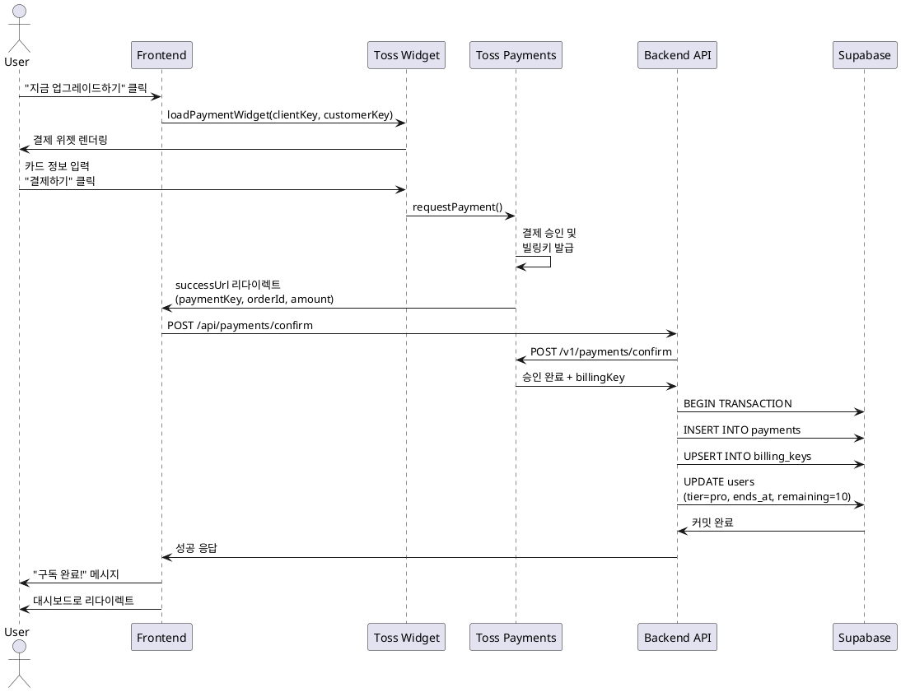

# 유스케이스 UC-004: Pro 요금제 업그레이드

## 1. 개요

### 1.1 목적
무료 사용자가 Pro 요금제로 업그레이드하여 월 10회 분석과 Gemini Pro 모델을 사용할 수 있도록 한다.

### 1.2 범위
- Pro 요금제 혜택 안내
- 토스페이먼츠를 통한 결제 처리
- 빌링키 발급 및 저장
- 사용자 구독 상태 업데이트

제외 사항:
- 정기 결제 (수동 결제 방식)
- 환불 처리 (구독 취소 시 다루어짐)

### 1.3 액터
- **주요 액터**: Free Tier 사용자
- **부 액터**: 토스페이먼츠, Supabase

## 2. 선행 조건
- 사용자가 로그인된 상태
- 사용자가 Free Tier (`subscription_tier = 'free'`)
- 유효한 결제 수단 (신용/체크카드) 보유

## 3. 참여 컴포넌트
- **Frontend**: Pro 업그레이드 페이지, 결제 위젯, 성공/실패 페이지
- **Toss Payments**: 결제 위젯 SDK, 결제 승인 API
- **Backend API**: `/api/payments/confirm` - 결제 승인 처리
- **Supabase**: users, payments, billing_keys 테이블

## 4. 기본 플로우 (Basic Flow)

### 4.1 단계별 흐름

**[사용자]**: 구독 관리 페이지에서 "Pro 요금제로 업그레이드" 버튼 클릭

**[Frontend]**: Pro 업그레이드 페이지 렌더링
- **출력**:
  - Pro 요금제 혜택 안내
    - 월 10회 분석
    - Gemini 2.5 Pro 모델 사용
    - 3,900원/월
  - "주의, 구독 후 환불이 불가합니다." 경고 문구
  - "지금 업그레이드하기" 버튼

**[사용자]**: "지금 업그레이드하기" 버튼 클릭

**[Frontend]**: 결제 페이지로 이동, 토스페이먼츠 위젯 로드
- **입력**:
  - `clientKey`: 환경 변수 (`NEXT_PUBLIC_TOSS_PAYMENTS_CLIENT_KEY`)
  - `customerKey`: Clerk 사용자 ID
  - `amount`: 3900
  - `orderId`: UUID 생성 (`uuid.v4()`)
  - `orderName`: "사주 분석 서비스 Pro 구독"
  - `customerName`: Clerk 사용자 이름
  - `customerEmail`: Clerk 사용자 이메일

**[Frontend]**: 토스페이먼츠 결제 위젯 렌더링
- **출력**:
  - 결제 수단 선택 UI (카드)
  - 카드 정보 입력 필드 (카드번호, 유효기간, 비밀번호, 생년월일)
  - 개인/법인 카드 선택
  - 이용 약관 동의 체크박스

**[사용자]**: 결제 정보 입력 및 "결제하기" 버튼 클릭

**[Toss Payments SDK]**: 결제 요청 전송
- **처리**:
  ```typescript
  paymentWidget.requestPayment({
    orderId, orderName, customerName, customerEmail,
    successUrl: `${origin}/success`,
    failUrl: `${origin}/fail`
  });
  ```

**[Toss Payments]**: 결제 처리 및 빌링키 발급
- **처리**:
  - 카드 정보 검증
  - 3,900원 결제 승인
  - 빌링키 발급 (구독 결제용)
- **출력**:
  - 성공 시: `successUrl`로 리다이렉트 + 쿼리 파라미터
    - `paymentKey`, `orderId`, `amount`
  - 실패 시: `failUrl`로 리다이렉트 + 에러 정보

**[Frontend - Success Page]**: `successUrl` 진입, 쿼리 파라미터 추출

**[Frontend]**: Backend API로 결제 승인 요청
- **입력**:
  ```json
  {
    "paymentKey": "payment_key_xyz789",
    "orderId": "order_abc123",
    "amount": 3900,
    "userId": "user-uuid"
  }
  ```

**[Backend API]**: `/api/payments/confirm` 엔드포인트 처리

**[Backend]**: 입력 검증
- `paymentKey`, `orderId`, `amount`, `userId` 존재 확인
- `amount = 3900` 검증

**[Backend]**: 토스페이먼츠 API로 결제 승인 요청
- **처리**:
  ```typescript
  const secretKey = process.env.TOSS_PAYMENTS_SECRET_KEY + ':';
  const authHeader = `Basic ${Buffer.from(secretKey).toString('base64')}`;

  const response = await fetch('https://api.tosspayments.com/v1/payments/confirm', {
    method: 'POST',
    headers: {
      Authorization: authHeader,
      'Content-Type': 'application/json'
    },
    body: JSON.stringify({ paymentKey, orderId, amount })
  });
  ```
- **출력**: 결제 승인 응답 + `billingKey`

**[Supabase]**: 트랜잭션 시작

**[Supabase]**: payments 테이블에 결제 레코드 INSERT
- **처리**:
  ```sql
  INSERT INTO payments (
    user_id, order_id, payment_key, amount, status
  ) VALUES (
    'user-uuid', 'order123', 'payment456', 3900, 'done'
  );
  ```

**[Supabase]**: billing_keys 테이블에 빌링키 UPSERT
- **처리**:
  ```sql
  INSERT INTO billing_keys (user_id, billing_key)
  VALUES ('user-uuid', 'billing789')
  ON CONFLICT (user_id) DO UPDATE SET billing_key = EXCLUDED.billing_key;
  ```

**[Supabase]**: users 테이블 구독 정보 UPDATE
- **처리**:
  ```sql
  UPDATE users
  SET
    subscription_tier = 'pro',
    subscription_ends_at = NOW() + INTERVAL '30 days',
    analyses_remaining = 10,
    cancelled_at = NULL
  WHERE id = 'user-uuid';
  ```

**[Supabase]**: 트랜잭션 커밋

**[Backend]**: 성공 응답 반환
- **출력**:
  ```json
  {
    "success": true,
    "subscriptionEndsAt": "2025-11-25T10:00:00Z"
  }
  ```

**[Frontend]**: 성공 메시지 표시
- **출력**:
  - "Pro 요금제 구독이 완료되었습니다!" 메시지
  - 구독 혜택 안내 (월 10회, Gemini Pro)
  - "대시보드로 이동" 버튼
  - 3초 후 자동 리다이렉트

**[Frontend]**: 대시보드로 리다이렉트, Pro 상태 표시

### 4.2 시퀀스 다이어그램



## 5. 대안 플로우 (Alternative Flows)

### 5.1 이미 Pro 사용자인 경우
**시작 조건**: 업그레이드 페이지 진입 시 `subscription_tier = 'pro'`

**단계**:
1. Backend에서 구독 상태 확인
2. "이미 Pro 요금제를 사용 중입니다" 메시지 표시
3. 구독 관리 페이지로 자동 리다이렉트

**결과**: 중복 구독 방지

## 6. 예외 플로우 (Exception Flows)

### 6.1 결제 위젯 로딩 실패
**발생 조건**: 토스페이먼츠 SDK 로드 실패 또는 네트워크 오류

**처리 방법**:
1. Frontend에서 로딩 타임아웃 감지 (10초)
2. 에러 메시지: "결제 위젯을 불러올 수 없습니다. 다시 시도해주세요."
3. "새로고침" 버튼 표시

**에러 코드**: `WIDGET_LOAD_FAILED` (클라이언트 레벨)

**사용자 메시지**: "결제 위젯을 불러올 수 없습니다. 페이지를 새로고침해주세요."

### 6.2 결제 실패 (카드 승인 거부)
**발생 조건**: 카드 한도 초과, 정지 카드, 정보 오류 등

**처리 방법**:
1. 토스페이먼츠가 `failUrl`로 리다이렉트
2. 쿼리 파라미터에서 에러 정보 추출
3. Frontend에서 에러 메시지 표시
4. "다시 시도" 버튼 클릭 시 결제 페이지로 복귀

**에러 코드**: 토스페이먼츠 에러 코드 (예: `CARD_LIMIT_EXCEEDED`)

**사용자 메시지**: "결제에 실패했습니다. [{에러 사유}] 다른 카드로 시도해주세요."

### 6.3 토스페이먼츠 승인 API 실패
**발생 조건**: Backend에서 `/v1/payments/confirm` 호출 실패

**처리 방법**:
1. Backend에서 API 응답 확인
2. HTTP 400/500 에러 처리
3. 에러 메시지: "결제 승인에 실패했습니다. 고객센터로 문의해주세요."
4. 로그 기록 및 관리자 알림

**에러 코드**: `PAYMENT_CONFIRM_FAILED` (HTTP 500)

**사용자 메시지**: "결제 승인에 실패했습니다. 고객센터로 문의해주세요. (주문번호: {orderId})"

### 6.4 Supabase 업데이트 실패
**발생 조건**: 데이터베이스 트랜잭션 실패

**처리 방법**:
1. Backend에서 트랜잭션 실패 감지
2. 롤백 처리 (결제는 이미 완료)
3. HTTP 500 Internal Server Error 반환
4. 에러 메시지: "구독 활성화에 실패했습니다. 고객센터로 문의해주세요."
5. 로그 기록 및 관리자 알림 (수동 복구 필요)

**에러 코드**: `SUBSCRIPTION_ACTIVATION_FAILED` (HTTP 500)

**사용자 메시지**: "구독 활성화에 실패했습니다. 결제는 완료되었으며, 고객센터에서 처리해드리겠습니다."

### 6.5 금액 불일치
**발생 조건**: Frontend와 Backend의 금액이 다름

**처리 방법**:
1. Backend에서 금액 검증 (`amount !== 3900`)
2. HTTP 400 Bad Request 반환
3. 결제 취소 API 호출
4. 에러 메시지: "결제 금액이 올바르지 않습니다."

**에러 코드**: `AMOUNT_MISMATCH` (HTTP 400)

### 6.6 중복 승인 요청
**발생 조건**: 사용자가 Success 페이지 새로고침 또는 중복 요청

**처리 방법**:
1. Backend에서 `orderId`로 기존 결제 조회
2. 이미 처리된 경우 기존 결과 반환
3. "이미 처리된 결제입니다" 메시지 표시
4. 대시보드로 리다이렉트

**에러 코드**: `PAYMENT_ALREADY_PROCESSED` (HTTP 200)

## 7. 후행 조건 (Post-conditions)

### 7.1 성공 시
**데이터베이스 변경**:
- `payments` 테이블: 결제 레코드 생성 (`status = 'done'`)
- `billing_keys` 테이블: 빌링키 저장
- `users` 테이블:
  - `subscription_tier = 'pro'`
  - `subscription_ends_at = NOW() + 30일`
  - `analyses_remaining = 10`
  - `cancelled_at = NULL`

**시스템 상태**:
- 사용자가 Pro 요금제 활성화
- 대시보드에 Pro 상태 표시

**외부 시스템**:
- 토스페이먼츠: 결제 완료, 빌링키 발급

### 7.2 실패 시
**데이터 롤백**:
- 트랜잭션 롤백 (결제 레코드 미생성)
- 사용자 구독 상태 유지 (Free)

**시스템 상태**:
- 사용자가 업그레이드 페이지 또는 실패 페이지에 있음
- 에러 메시지 표시

## 8. 비기능 요구사항

### 8.1 성능
- 결제 위젯 로드: 3초 이내
- 결제 승인 API: 2초 이내
- 전체 업그레이드 프로세스: 10초 이내

### 8.2 보안
- `TOSS_PAYMENTS_SECRET_KEY` 서버 환경 변수로 관리
- 결제 금액 서버 측 검증 필수
- HTTPS 통신 필수
- 빌링키 암호화 저장 (Supabase 기본 암호화)

### 8.3 가용성
- 토스페이먼츠 API 실패 시 재시도 로직
- 중복 결제 방지

## 9. UI/UX 요구사항

### 9.1 화면 구성
- Pro 업그레이드 페이지:
  - 헤더: "Pro 요금제로 업그레이드"
  - 혜택 안내 카드:
    - 월 10회 분석
    - Gemini 2.5 Pro 모델
    - 3,900원/월
  - 경고 문구: "주의, 구독 후 환불이 불가합니다."
  - "지금 업그레이드하기" 버튼

- 결제 페이지:
  - 결제 위젯 (토스페이먼츠)
  - 주문 정보: "사주 분석 서비스 Pro 구독 - 3,900원"
  - 이용 약관 동의 체크박스

- 성공 페이지:
  - 체크마크 아이콘
  - "Pro 요금제 구독이 완료되었습니다!" 메시지
  - 혜택 안내
  - "대시보드로 이동" 버튼

### 9.2 사용자 경험
- 결제 위젯 로딩 시 스켈레톤 UI
- 결제 중 로딩 인디케이터
- 성공 후 3초 자동 리다이렉트 (카운트다운 표시)
- 에러 발생 시 명확한 메시지 및 재시도 옵션

## 10. 테스트 시나리오

### 10.1 성공 케이스
| 테스트 케이스 ID | 입력값 | 기대 결과 |
|---|---|---|
| TC-004-01 | Free Tier, 유효한 카드 | 결제 성공, Pro 활성화 |
| TC-004-02 | 결제 완료 후 Success 페이지 | Pro 상태 표시, 10회 분석 |

### 10.2 실패 케이스
| 테스트 케이스 ID | 입력값 | 기대 결과 |
|---|---|---|
| TC-004-03 | 이미 Pro 사용자 | "이미 Pro입니다" 메시지 |
| TC-004-04 | 카드 한도 초과 | 결제 실패, 에러 메시지 |
| TC-004-05 | 결제 승인 API 실패 | "고객센터 문의" 메시지 |
| TC-004-06 | Supabase 업데이트 실패 | "활성화 실패" 메시지 |
| TC-004-07 | 금액 불일치 | 결제 취소, 에러 메시지 |

## 11. 관련 유스케이스
- **선행 유스케이스**: UC-002 (대시보드), UC-003 (새 분석하기 - 횟수 부족 시)
- **후행 유스케이스**: UC-003 (Pro 모델로 새 분석)
- **연관 유스케이스**: UC-006 (구독 취소)

## 12. 변경 이력
| 버전 | 날짜 | 작성자 | 변경 내용 |
|---|---|---|---|
| 1.0 | 2025-10-25 | Usecase Writer Agent | 초기 작성 |

## 부록

### A. 용어 정의
- **빌링키**: 구독 결제를 위한 카드 인증 정보 (카드 번호 대신 사용)
- **토스페이먼츠**: 한국의 간편 결제 서비스
- **UPSERT**: INSERT 또는 UPDATE (존재하면 업데이트, 없으면 삽입)

### B. 참고 자료
- 토스페이먼츠 문서: https://docs.tosspayments.com
- 토스페이먼츠 SDK: https://docs.tosspayments.com/reference/widget-sdk
- 외부 연동 가이드: `/docs/external/clerk&tosspayment.md`
